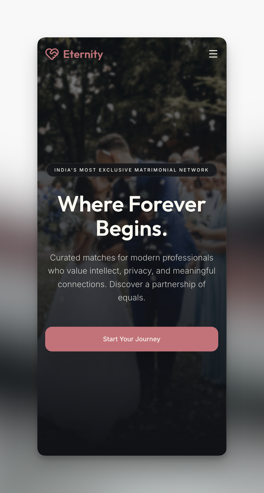

# Eternity Matrimony
> A premium, security-first matchmaking platform designed for modern professionals to discover authentic connections through intuitive filtering and real-time interaction control.

[](https://eternity-snowy.vercel.app/)
[](https://github.com/hritikbytes/eternity/blob/main/LICENSE)
[](https://github.com/hritikbytes/eternity/stargazers)
[](https://github.com/hritikbytes/eternity/network/members)

🔗 **Live URL:** [eternity-snowy.vercel.app](https://eternity-snowy.vercel.app/)


## 📸 Preview
| Home Page | Mobile Responsive |
|-----------|-------------------|
|  |  |

## 🚀 Key Features
- **Premium, Responsive Aesthetics:** Engineered with a bespoke dark/light theme utilizing the modern OKLCH color space, fluid layout structures, custom shimmer states, and interactive animations powered by Framer Motion.
- **Multilevel Verification & Onboarding:** Implemented client-side and server-side validated profile generation (personal, professional, and lifestyle criteria) powered by React Hook Form & Zod schemas, integrating Cloudinary for optimized media management.
- **Granular Multi-Parametric Search:** Designed a comprehensive, server-rendered profile indexing filter system enabling searches based on location, age range, community, education, income tier, and marital status.
- **Secure Bi-Directional Connection Routing:** Architected a secure connection request workflow (supporting pending, accepted, rejected, and cancelled states) backed by strict PostgreSQL database relations.
- **Enterprise Security & Route Guardrails:** Implemented secure middleware redirects for authenticated routes (`/dashboard`, `/profile`, `/search`, `/requests`) and administrative spaces, paired with server-side validation to block open-redirect exploits.

## 🛠 Tech Stack
- **Frontend:** Next.js 16 (App Router), React 19, Tailwind CSS v4, Framer Motion, Lucide React, Radix-based UI Primitives, Sonner Toast Notifications
- **Backend / Database:** Supabase Database (Postgres), Supabase Auth / SSR Client, PostgreSQL Row Level Security (RLS)
- **Tools:** TypeScript, Zod, React Hook Form, Cloudinary Media Engine, ESLint, Webpack Bundler Engine

## 📦 Installation & Setup
1. **Clone the repo:**
   ```bash
   git clone https://github.com/hritikbytes/eternity.git
   cd eternity
   ```
2. **Install dependencies:**
   ```bash
   npm install
   ```
3. **Set up Environment Variables:**
   Create a `.env.local` file in the root folder based on the template below:
   ```env
   # Supabase Configurations
   NEXT_PUBLIC_SUPABASE_URL=https://YOUR_PROJECT.supabase.co
   NEXT_PUBLIC_SUPABASE_ANON_KEY=your_supabase_anon_key

   # Site Configurations
   NEXT_PUBLIC_SITE_URL=http://localhost:3000

   # Cloudinary Media Configuration
   NEXT_PUBLIC_CLOUDINARY_CLOUD_NAME=your_cloud_name
   NEXT_PUBLIC_CLOUDINARY_UPLOAD_PRESET=your_upload_preset
   CLOUDINARY_API_KEY=your_api_key
   CLOUDINARY_API_SECRET=your_api_secret
   ```
4. **Run the app:**
   ```bash
   npm run dev
   ```

## 💡 Technical Challenges & Learning
### Server-Side Security & Cache Synchronization in Next.js Server Actions
During development, ensuring data integrity within bi-directional user connection requests (like sending and updating interests) presented a major challenge. Since client-side state validations can easily be bypassed, I engineered duplicate, server-side Zod validators to sanitize all payload formats prior to database queries. To guarantee that user actions (e.g., accepting or rejecting a connection) are authorized, the Next.js Server Actions verify the active Supabase user session on every request, verifying matching user privileges before mutating entries. Additionally, I implemented Next.js `revalidatePath` calls directly within the transaction blocks to purge the route cache. This resolved the issue of UI lag and stale data views by forcing immediate, reactive server-driven updates across `/dashboard`, `/search`, and `/requests` pages without relying on heavy client-side polling.

### Adapting to Tailwind CSS v4 & OKLCH Theme Architecture
Another complex hurdle was designing custom themes utilizing the advanced OKLCH color model natively integrated with the Tailwind v4 compiler. This required mapping color values using OKLCH coordinate specifications (`oklch(L C H)`) to maintain visual harmony in both light and dark modes. I overcame configuration discrepancies by constructing a custom `@theme inline` block directly in `globals.css`, defining theme-wide variables that align with Shadcn components, custom scrollbars, floating animations, and skeleton loaders.

## 🛣 Roadmap
- [ ] **AI-Powered Compatibility Matching:** Integrate partner-preference vector-distance algorithms to calculate accurate compatibility percentages.
- [ ] **Real-Time Instant Messaging:** Deploy Supabase PostgreSQL Realtime listeners to facilitate secure chat interfaces between accepted matches.
- [ ] **Multi-Image Profiles & Upload Carousel:** Build a media slide gallery for user profiles integrated directly with the Cloudinary Upload widget.
- [ ] **Premium Subscription Stripe/Razorpay Integration:** Add payment processing to allow users to upgrade to premium tier features.

## 🤝 Contact
- **Developer:** Hritik Sharma
- **Links:** [LinkedIn](https://www.linkedin.com/in/hritiksharma0608/) | [GitHub](https://github.com/hritikbytes)
- **Email:** hritiksharma.0608@gmail.com
